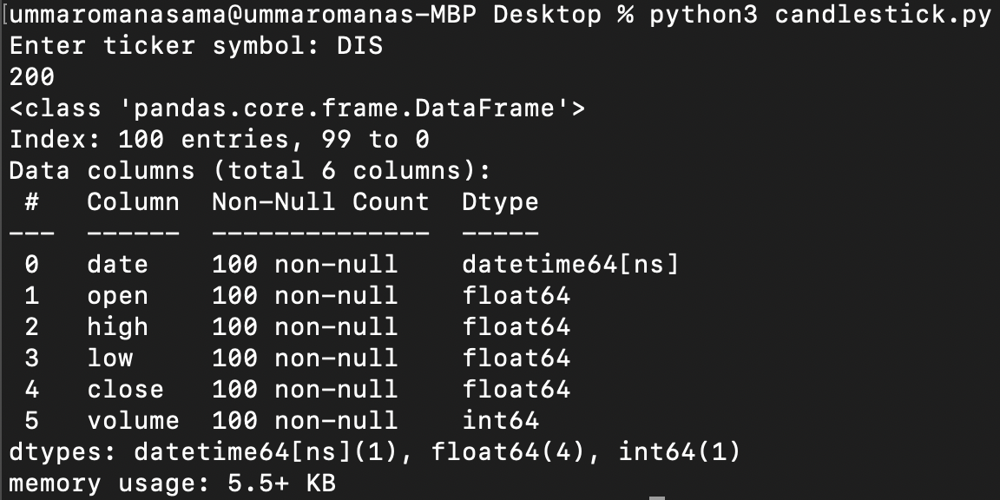

# Investing

Overview: This project was an opportunity for me to explore python in the context of data science, how to read candlestick charts, and have a better understanding of companies from an investors point of view.
* You can ask for your desired ticker's candlestick chart utilizing Alpha Vantages API for data and Bokeh library to generate the graph in candlesticks.py. 
* Retrieve the dividend yield of your desired ticker from googlesheets.py which uses a spreadsheet as a database from dripinvest.org. For this, I used gspread (Google Sheets Python API) to make the data from the google spreadsheet tangible for me in python. 

